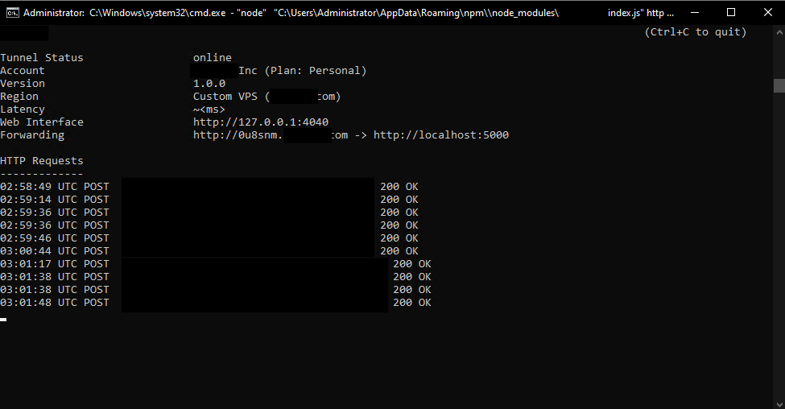
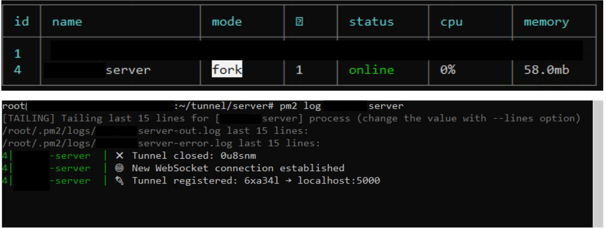

<div align="center">

  

  <h1><b>LIPTunnel</b></h1>
  <h3>Your Tunnel. Your Domain. Your Control.</h3>

</div>


# 🌐 LIPTunnel — Self-Hosted Ngrok Alternative

LIPTunnel is a fast, lightweight, self-hosted tunneling system that exposes your local server to the internet using **your own VPS + domain**.

No subscriptions.  
No limits.  
No tracking.  
Just a simple Node.js tunnel that YOU control.

Created by **Lasisi Ibrahim Pelumi (Full-Stack Engineer)**.

---

## 📁 Repository Folder Structure

```bash 
liptunnel/
 ├─ bin/
 │   └─ liptunnel.js        # CLI client (runs on user machine)
 ├─ server/
 │   └─ server.js           # Tunnel server (runs on VPS)
 ├─ docs/
 │   │ architecture.md
 │   └─ multi-tunnel.md
 ├─ package.json
 ├─ README.md
 ├─ LICENSE
 ```

---

## 🚀 Features

- 🔥 Expose any local port over HTTP  
- 🌍 Generates public URLs like:  
  `http://abcd12.yourdomain.com`
- 🛰 Works with ANY VPS (even old VPN servers)  
- ⚡ Real-time request forwarding  
- 🖥 Local dashboard: `http://127.0.0.1:4040`  
- 🔐 No third-party services (no Ngrok, no Cloudflare Tunnels)  
- 💻 Works on Windows, macOS, Linux  
- 🛠 Zero configuration required  
- 🧩 Full open-source control  

---

## 📸 Demo Screenshot

Below is an actual output of **LIPTunnel running live**:

#### Screenshot 1 → Client side (your CMD window



#### Screenshot 2 → Server side (PM2)




This shows:

✔ Tunnel status  
✔ Forwarding URL  
✔ Live request logs  
✔ Dashboard URL  
✔ Version + region  
✔ Successful POST requests  

---

## 🧠 How It Works

1. You run the tunnel server on your VPS.  
2. You run the LIPTunnel client on your computer:  

   ```bash
   liptunnel http 5000 --server yourdomain.com

   ```

3. The client opens a WebSocket connection to your VPS.

4. Your VPS assigns a random subdomain, e.g.:
   
```bash
http://u8smnt.yourdomain.com
```

5. Incoming HTTP requests are forwarded directly to your local machine.

---

## 🏗 Architecture

```bash
User → yourdomain.com → LIPTunnel VPS → WebSocket → your computer → localhost:5000
```

### Reverse tunneling, simple and fast.

---

## ⚙ Requirements

- Node.js 18+
- A domain you control
- A VPS (1 CPU / 512MB RAM is enough — even old servers work)
- Port 80 available (or use Nginx reverse proxy)

---

## 📥 Installation
1. Clone the project
```bash
git clone https://github.com/ibrahimpelumi6142/liptunnel.git
cd liptunnel
npm install
```
---

## 🚀 Start the VPS Tunnel Server

### On your VPS:
```bash
npm run start:server
```

#### This starts the server on port 80.

### DNS Setup (recommended)

#### Create this DNS record:
```bash
*.yourdomain.com   A   <your-vps-ip>
```
---

## 💻 Start the Local Client

### On your local machine:

```bash
liptunnel http 5000 --server yourdomain.com
```

### Example output:

```bash
Forwarding: http://abcd12.yourdomain.com → http://localhost:5000
```
#### Visit this URL from anywhere in the world — it hits your local machine.

### 🔧 Local Dashboard

#### Open:
```bash
http://127.0.0.1:4040
```

#### It shows:

- Recent requests
- HTTP status
- Tunnel info

---

## 🛡 Why LIPTunnel?

| Feature              | LIPTunnel | Ngrok     |
|----------------------|-----------|-----------|
| Free                 | ✅        | ❌        |
| Unlimited tunnels    | ✅        | ❌        |
| Use your own domain  | ✅        | Paid only |
| Self-hosted          | ✅        | ❌        |
| Logs stored locally  | ✅        | ❌        |
| Identity branding    | **You**   | Ngrok     |

### LIPTunnel gives you full control, privacy, and freedom.

---

## 🧱 Roadmap

 - HTTPS support (Let’s Encrypt)
 - Named fixed subdomains
 - Authentication tokens
 - Multi-tunnel support
 - Web-based management UI
 - Docker containers

---

## 👨‍💻 Author

- Lasisi Ibrahim Pelumi
- Full-Stack Engineer • Automation Developer

- GitHub: https://github.com/ibrahimpelumi6142
- Email: ibrahimpelumi6142@gmail.com

### If you like this project, please ⭐ star the repo.

---

## 📜 License

MIT License — free to use, modify, and distribute.
