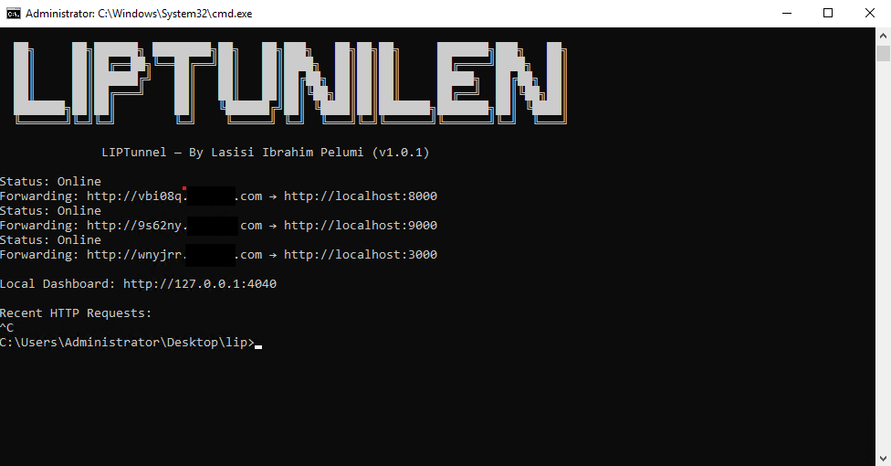

<div align="center">

  

  <h1><b>LIPTunnel</b></h1>
  <h3>Your Tunnel. Your Domain. Your Control.</h3>

</div>

# 🌐 LIPTunnel — Self-Hosted Ngrok Alternative

LIPTunnel is a fast, lightweight, self-hosted tunneling system that exposes your local server to the internet using **your own VPS + domain**.

No subscriptions.  
No limits.  
No tracking.  
Just a simple Node.js tunnel that YOU control.

Created by **Lasisi Ibrahim Pelumi (Full-Stack Engineer)**.

---

## ⚡ What's New in v1.1.0

### 🚀 Multi-Tunnel Support

Run multiple tunnels with a single command!

**Before:**
```bash
# Need 3 terminal windows
liptunnel http 3000 --server yourdomain.com
liptunnel http 8080 --server yourdomain.com
liptunnel http 5000 --server yourdomain.com
```

**Now:**
```bash
# Just one command!
liptunnel http 3000,8080,5000 --multi --server yourdomain.com
```

**Output:**
```
Multi-Tunnel Mode: Active

Forwarding 1: http://tunnel1-abc.yourdomain.com → http://localhost:3000
Forwarding 2: http://tunnel2-def.yourdomain.com → http://localhost:8080
Forwarding 3: http://tunnel3-ghi.yourdomain.com → http://localhost:5000
```

Perfect for:
- 🔧 Microservices development
- 🌐 Full-stack projects (frontend + backend)
- 🔌 Webhook testing (API + webhook receiver)
- 📱 Mobile app development

---

## 📁 Repository Folder Structure
```bash 
liptunnel/
 ├─ bin/
 │   └─ liptunnel.js        # CLI client (runs on user machine)
 ├─ server/
 │   └─ server.js           # Tunnel server (runs on VPS)
 ├─ docs/
 │   ├─ architecture.md
 │   └─ multi-tunnel.md
 ├─ assets/
 │   ├─ liptunnel-banner.gif
 │   ├─ liptunnel-demo.png
 │   └─ server-pm2.png
 ├─ package.json
 ├─ README.md
 └─ LICENSE
```

---

## 🚀 Features

- 🔥 Expose any local port over HTTP  
- 🌍 Generates public URLs like: `http://abcd12.yourdomain.com`
- 🚀 **NEW:** Multi-tunnel support - run multiple ports simultaneously
- 🎯 **NEW:** `--multi` flag for numbered forwarding display
- 🛰 Works with ANY VPS (even old VPN servers)  
- ⚡ Real-time request forwarding  
- 🖥 Local dashboard: `http://127.0.0.1:4040`  
- 🔐 No third-party services (no Ngrok, no Cloudflare Tunnels)  
- 💻 Works on Windows, macOS, Linux  
- 🛠 Zero configuration required  
- 🧩 Full open-source control  
- ✅ Fully backward compatible

---

## 📸 Demo Screenshot

Below is an actual output of **LIPTunnel running live**:

#### Screenshot 1 → Client side (your CMD window)



#### Screenshot 2 → Server side (PM2)


This shows:

✔ Tunnel status  
✔ Forwarding URL  
✔ Live request logs  
✔ Dashboard URL  
✔ Version + region  
✔ Successful POST requests  

---

## 🧠 How It Works

1. You run the tunnel server on your VPS.  
2. You run the LIPTunnel client on your computer:  
```bash
   liptunnel http 5000 --server yourdomain.com
```

3. The client opens a WebSocket connection to your VPS.

4. Your VPS assigns a random subdomain, e.g.:
```bash
   http://u8smnt.yourdomain.com
```

5. Incoming HTTP requests are forwarded directly to your local machine.

---

## 🏗 Architecture
```bash
User → yourdomain.com → LIPTunnel VPS → WebSocket → your computer → localhost:5000
```

### Reverse tunneling, simple and fast.

---

## ⚙ Requirements

- Node.js 18+
- A domain you control
- A VPS (1 CPU / 512MB RAM is enough — even old servers work)
- Port 80 available (or use Nginx reverse proxy)

---

## 📥 Installation

1. Clone the project
```bash
git clone https://github.com/ibrahimpelumi6142/liptunnel.git
cd liptunnel
npm install
```

2. **Configure your domain** (Optional)

   Edit `bin/liptunnel.js` line 50:
```javascript
   let serverHost = "your-actual-domain.com";  // Replace with your domain
```
   
   Or use the `--server` flag when running (see usage below).

---

## 🚀 Start the VPS Tunnel Server

### On your VPS:
```bash
npm run start:server
```

#### This starts the server on port 80.

### DNS Setup (recommended)

#### Create this DNS record:
```bash
*.yourdomain.com   A   <your-vps-ip>
```

---

## 💻 Usage

### Single Tunnel (Normal Mode)

On your local machine:
```bash
liptunnel http 5000 --server yourdomain.com
```

**Output:**
```bash
Status: Online
Forwarding: http://abcd12.yourdomain.com → http://localhost:5000
```

Visit this URL from anywhere in the world — it hits your local machine.

---

### Multiple Tunnels (Multi Mode)

Run multiple services at once:
```bash
liptunnel http 3000,8080,5000 --multi --server yourdomain.com
```

**Output:**
```bash
Multi-Tunnel Mode: Active

Forwarding 1: http://tunnel1-abc.yourdomain.com → http://localhost:3000
Forwarding 2: http://tunnel2-def.yourdomain.com → http://localhost:8080
Forwarding 3: http://tunnel3-ghi.yourdomain.com → http://localhost:5000
```

#### Use Cases:

**Microservices Development:**
```bash
liptunnel http 3000,4000,5000 --multi --server yourdomain.com
# 3000 → User Service
# 4000 → Auth Service  
# 5000 → Payment Service
```

**Full-Stack Development:**
```bash
liptunnel http 3000,8080 --multi --server yourdomain.com
# 3000 → React frontend
# 8080 → Express API
```

**API + Webhook Testing:**
```bash
liptunnel http 8000,8001 --multi --server yourdomain.com
# 8000 → Main API
# 8001 → Webhook receiver (Stripe, GitHub, etc.)
```

---

## 🔧 Local Dashboard

#### Open:
```bash
http://127.0.0.1:4040
```

#### It shows:

- Recent requests
- HTTP status
- Tunnel info
- **Multi-tunnel view** (when using `--multi`)

---

## 🛡 Why LIPTunnel?

| Feature              | LIPTunnel | Ngrok     | Cloudflare Tunnel |
|----------------------|-----------|-----------|-------------------|
| Free                 | ✅        | Limited   | ✅                |
| Unlimited tunnels    | ✅        | ❌        | ✅                |
| Use your own domain  | ✅        | Paid only | ✅                |
| Self-hosted          | ✅        | ❌        | ❌                |
| Logs stored locally  | ✅        | ❌        | ❌                |
| No tracking          | ✅        | ❌        | ❌                |
| Identity branding    | **You**   | Ngrok     | Cloudflare        |
| Multi-tunnel         | ✅        | ❌        | ✅                |
| Setup time           | 5 min     | 2 min     | 10 min            |

### LIPTunnel gives you full control, privacy, and freedom.

---

## 📚 Documentation

- [Architecture](docs/architecture.md) - System design and flow
- [Multi-Tunnel Guide](docs/multi-tunnel.md) - Detailed multi-tunnel usage

---

## 🧱 Roadmap

- [x] Multi-tunnel support ✅ **v1.1.0**
- [ ] HTTPS support (Let's Encrypt)
- [ ] Named fixed subdomains
- [ ] Authentication tokens
- [ ] Configuration file support
- [ ] Web-based management UI
- [ ] Docker containers

---

## 🤝 Contributing

Contributions are welcome! Please feel free to submit a Pull Request.

1. Fork the repository
2. Create your feature branch (`git checkout -b feature/amazing-feature`)
3. Commit your changes (`git commit -m 'feat: add amazing feature'`)
4. Push to the branch (`git push origin feature/amazing-feature`)
5. Open a Pull Request

---

## 👨‍💻 Author

**Lasisi Ibrahim Pelumi**  
Full-Stack Engineer • Automation Developer

- GitHub: [@ibrahimpelumi6142](https://github.com/ibrahimpelumi6142)
- Email: ibrahimpelumi6142@gmail.com
- YouTube: [@bestspotsolution](https://youtube.com/@bestspotsolution)
- Website: [onlinequicktools.com](https://onlinequicktools.com)

### If you like this project, please ⭐ star the repo.

---

## 📝 Changelog

### v1.1.0 (2026-01-22)
- ✨ Added multi-tunnel support with comma-separated ports
- ✨ Added `--multi` flag for numbered forwarding display
- ✨ Enhanced dashboard for multiple tunnels
- ✨ Per-tunnel logging in multi mode
- ✅ Fully backward compatible with v1.0.x

### v1.0.1
- 🐛 Bug fixes and improvements

### v1.0.0
- 🎉 Initial release

---

## 📜 License

MIT License — free to use, modify, and distribute.

---

**Made with ❤️ for developers who value privacy and control**
